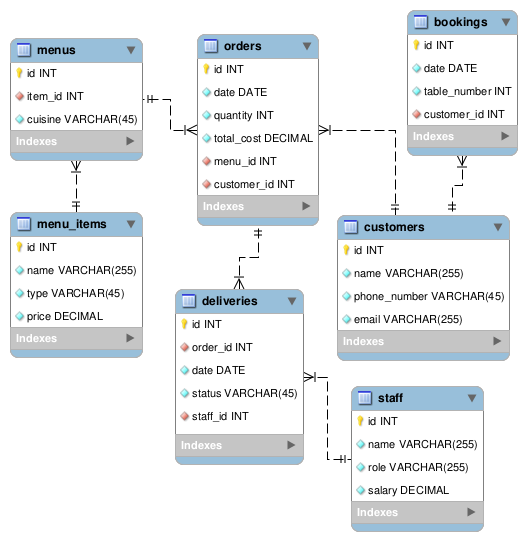

# Meta: Database Capstone Project

This repository serves as my personal submission for the [Database Engineer Capstone Project](https://www.coursera.org/professional-certificates/meta-database-engineer) offered by Meta through Coursera.



## Submission Structure

```
db-capstone-project-meta
  │
  mysql-workbench/
  │    ├───er-diagram.png <- Project's ER Diagram
  │    ├───forward-engineer.sql <- Forward Engineer's Output
  │    ├───insert-base-data.sql <- Mock Data
  │    ├───little_lemon_model.mwb <- Database Model File
  │    └───show-databases-query.sql <- DB List
  │
  tableau/
  │    ├───CuisineSalesAndProfit.png
  │    ├───CustomerSales.png
  │    ├───Dashboard.png
  │    ├───little_lemon_visualization.twb <- Tableau File
  │    ├───ProfitChart.png
  │    ├───raw-dataset.xlsx <- Data Source
  │    └───SalesBubbleChart.png
  │
  create-a-virtual-table-to-summarize-data.sql
  create-optimized-queries-to-manage-and-analyze-data.sql
  create-sql-queries-to-add-and-update-bookings.sql
  create-sql-queries-to-check-available-bookings-based-on-user-input.sql
  db-client.ipynb
```


## Database User Credentials


### Root User:

**Username:** `root`

**Password:** `password`


### Project Specific User:

**Username:** `little_lemon_dev`

**Password:** `password`